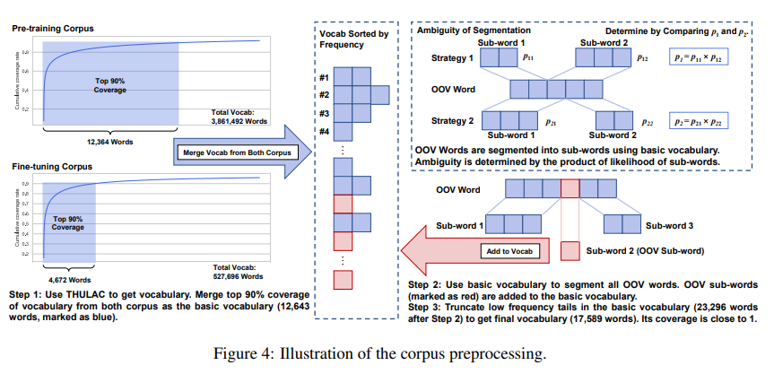
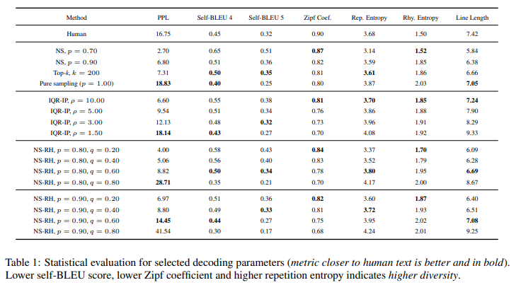
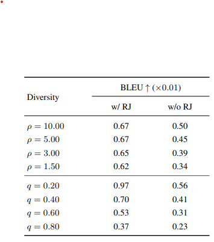
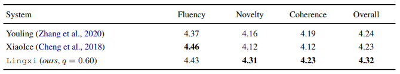

# [Lingxi: A Diversity-aware Chinese Modern Poetry Generation System](https://arxiv.org/pdf/2108.12108.pdf)

## 摘要

好的中文現代詩，遵循[陌生化原則](https://zh.wikipedia.org/zh-tw/%E9%99%8C%E7%94%9F%E5%8C%96)，低頻詞和模糊的句子被認為是新穎有創意的。本論文提出Lingxi希望可以生出這種詩。

[Nucleus Sampling](https://zhuanlan.zhihu.com/p/442557114) with ramdomized heads: 將預測分布的高頻"頭"隨機化，強調低頻詞，增加新穎性，調整高頻率波參數，可以控制分布變化，實現所謂Diversity-aware，詞彙過濾有隨機性(近80%)，但還是可以生成流暢詩歌，且符合新穎性目的。

語意相似拒採樣: 取符合條件的樣本(拒採樣, [Rejection Sampling](https://rpubs.com/hcygeorge/simulation03))，創造亙多信息輸入給模型，和上次說明的KEE目的相似。

## 簡介

Nucleus Sampling(Top-p Sampling): 使用隨機抽樣(stochastic sampling)取代beam search緩解文本退化(text degeneration)，截斷低頻保證品質，in PGT(Poem Generation Task) 扔會生成無趣且重複的詩，沒解決新詩的陌生化原則。

此論文之場景:指輸入標題OR KEY Word，生成完整詩歌段落

## Pre-train LM

發布一名為GPT-LyricCN的Pre-train LM:

* pre-train data: 3500本已出版中文小說
* fine-tuning data:  22萬首現代詩和中文音樂歌詞
* 訓練方法: 同GPT-2

詞表取得: 

1. THULAC分詞處理語料，詞頻排序取Top-90%為basic vocab(共12643)
2. OOV以basic vocab分詞，如無法處理，將該詞加入basic vocab(共23296)，如有多種切法，取[maximum likehood product](https://zhuanlan.zhihu.com/p/26614750)
3. 再次對basic vocab排序取Top-n為final vocab(共17589)

## Diversity-aware Sampling(多樣性抽樣)

### Controllable Diversity by Permutating  the “Head” of Predicted Distribution(通過置換預測分佈的“頭部(高頻)”來控制多樣性)

#### *警告 : 以下說明以斜體表示內容有可能錯誤，有其他解釋空間，請參考原論文或跟我討論你的看法*

Top-p Sampling ,Top-k Sampling: 克服文本退化，better than beam-search，但在PGT無效。

解法: 先取一次Top-p Sampling(q)，取head的過閥值的部分(最大機率/n)然後重新分配機率密度，*head外的在做一次Top-p Sampling(q)取head(可能錯誤:有可能不只是head外，head內也可能會)*，在這個新的分布隨機抽樣。

### Semantic-similarity-based Rejection Sampling Algorithm(基於語義相似性的拒絕採樣算法)

使用機率低的詞Decode實際會出現主題偏離的情形。

解法:

1. 對前M個token進行N次取樣。
2. 對每個樣本token計算和輸入主題(標題、關鍵字)的相似度(BERT Sentence embedding 算餘弦相似度(夾角))，接受最大值樣本token。
3. 將此token送model，decode出剩餘token。

##  Demonstration and Evaluation

### evaluation paradigm

PPL(Perplexity, 混淆度): 生成樣本的總體流暢度（分數越低表示流暢度越高，但越無聊）

Self-BLEU: 不同樣本之間的多樣性(分數越低表示多樣性越高)

Zipf: 反映詞頻分佈特徵(分數越低表示詞頻分佈越平坦，多樣性越高)

Repetition entropy: 分數越高表示重複越少，多樣性越高， $\mathbb{E} \left \{ - \log_{}{p\left ( x \right ) }  \right \} $，$p\left ( x \right )$為生成樣本中的詞頻分佈

Rhyming entropy: 分數越高表示多樣性越高，但押韻越少，$\mathbb{E} \left \{ - \log_{}{p_{rhyme}\left ( x \right ) }  \right \}$，$p_{rhyme}\left ( x \right )$為生成樣本中的押韻頻率分佈

line length: 生成樣本中每行詩出現的單詞平均數，越高分代表這首詩越長，且使用更豐富的詞彙

### evaluation

PPL: 傳統隨機採樣方法生成的樣本嚴重退化，因為它們的PPL（NS，p = 0.70 或 0.90 和 top-k，k = 200）遠低於人類，更高的PPL可能被認為是詩意的，當 p = 1.00 時才能達到接近人類指標的最大 PPL，在此狀態下模型會無條件考慮低機率詞，破壞詩的結構。相比之下，NS-RH的PPL到達人類水平，有條件考慮低機率詞，不會破壞詩的結構。輸出Robustness可透過p、q調整。NS-RH 在 p = 0.90, q = 0.80 並且生成了滿意的樣本，代表其Top80%的選擇是隨機的，扔然能生成流暢詩歌，在 p = 0.80, q = 0.80(砍掉"尾")更近似人類。

Self-BLEU: 實現人類指標

Zipf: 達到更低值，代表生成所使用的詞彙更加多樣化

Repetition entropy: 達到更高值，代表重複性更低

Rhyming entropy: 高於人類，表明犧牲押韻能力換取多樣性

line length: 實現與人類文本相似的詩歌格式

### 消融測試:拒絕採樣算法

圖表左方為使用拒絕採樣算法的結果，右方反之。可以看見使用拒絕採樣算法的模型生成前後文的BLEU分數更高，有助於保持主題的一致性。

### 人類評價

和其他現有的生成系統(Youling(屬性控制), XiaoIce(img2poem))評價，以"泉水"為輸入，生50首詩，每項1~5分↑。

人員組成: 研究生、研究小組顧問、音樂家和作曲家

Fluency: 流暢性，側重語法與語言學

Novelty: 新穎性，詩意和創造性

Coherence: 連貫性，詩歌與標題連貫性

Overall: 以上平均

## 總結

1. Lingxi: Diversity-aware 中文現代詩生成器
2. NS-RH: 可控多樣性解碼方法
3: Semantic-similarity-based Rejection Sampling: 緩解主題偏移

將分布高頻隨機化，顯著增加生成詩歌新穎性。
