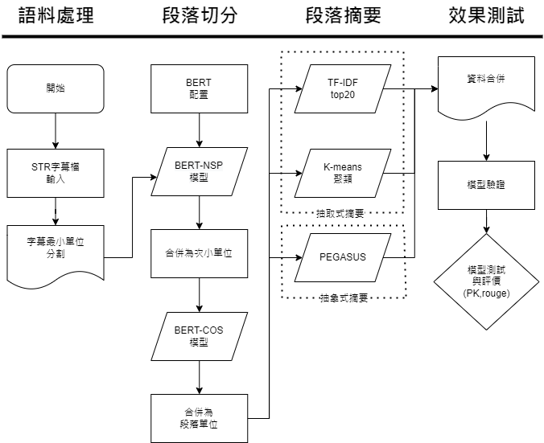
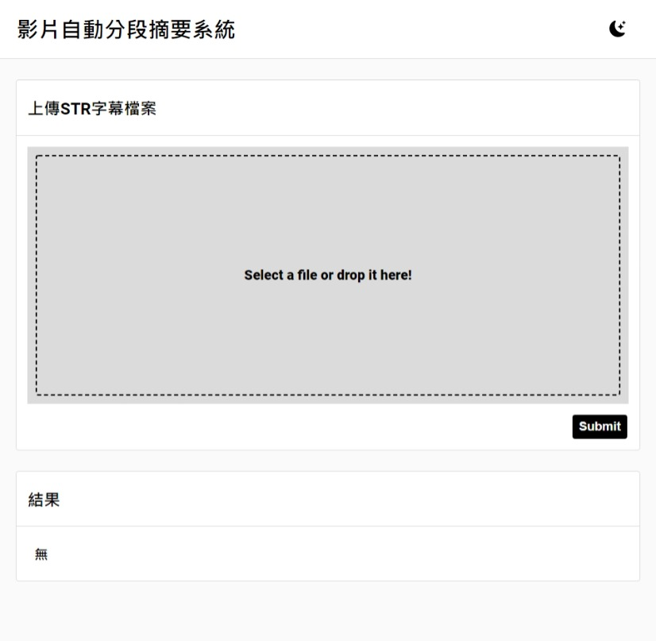
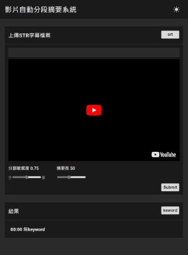

# 影片段落邊界辨識與段落描述生成探討

## 摘要

<!-- 近期線上課程與網路影片興盛，大學端也養成了課程錄影的習慣，但大部分的課程錄影不會做太多的剪輯，一段錄影至少30分鐘起跳，未經整理的影片十分冗長且難以理解，於是本研究提出一套流程，透過影片字幕檔STR，和BERT預訓練時學習的NSP(Next Sentence Prediction)任務，自動選擇影片段落的切分點，並對切分的段落產生一段摘要，我們測試了需多方法去生成摘要，主要分兩類，抽取式和抽象式，抽取式主要從輸入文本中選擇重要的內容將其輸出，可以將其視為一種分類問題(重要or不重要)，抽象式摘要則是根據輸入文本的內容生成出一段相較簡短但意義近似的文本，可以將其視為一種風格轉移(攏長的transfer簡短的)，最後我們選擇了Pegasus作為我們的摘要模型。 -->

近期線上課程與網路影片興盛，大學端也養成了課程錄影的習慣，但大部分的課程錄影並不會做太多的剪輯，一段錄影至少30分鐘起跳，未經整理的影片十分的冗長且難以理解。為針對此問題，本研究將其拆解為兩個部分：邊界辨識和段落摘要，我們希望(本研究期望)將影片字幕檔STR送入邊界辨識模型取得段落切分點，並將每個切分點間的文本送入摘要模型得到段落摘要。邊界辨識的部分本研究使用BERT，透過其在Pre-train學習的NSP(Next Sentence Prediction)任務和段落向量間的餘弦相似性，自動選擇影片段落的切分點；而段落摘要模型我們分別使用抽象式的Pegasus和抽取式的句向量K-means提供使用者選擇關鍵字描述或短文描述的方案。

關鍵字：影片段落邊界辨識、影片段落摘要

## Abstract

## 1.研究動機與目的

<!-- 最近影音平台如YT等等，提供TIMECODE功能，讓閱聽人可以快速跳到段落主題的開頭，使閱聽人可快速瀏覽影片的整體架構，達到快速理解快速吸收的效果，而TIMECODE目前多是上傳者對其手動標記，但影片的長度一長，如課程錄影、立法院會期紀錄這種壟長且沒有腳本或大綱的影片，人工標註的方法會需要對影片有足夠的了解才能對其整理，這個過程十分的耗時，於是我們想要研究可以有效辨別影片段落邊界和生成影片段落摘要的方法。 -->

最近許多影音平台皆推出了各種方便的輔助功能，例如Youtube中的TIMECODE功能，其功用為讓閱聽人可快速跳到影片中不同主題之段落，使閱聽人可迅速了解影片的整體架構，並達到快速理解且消化影片內容的效果。而TIMECODE目前多是由上傳者在影片上手動標記，一但影片的長度變長，如課程錄影、立法院會期紀錄這種冗長且沒有腳本或大綱的影片，若使用人工標記的方法，不僅要完全理解影片的內容，還得自行切出好幾個不同主題的段落，這絕對是一個耗時的大工程，這也促使我們著手研究可以有效判別影片段落邊界並生成影片段落摘要的方法。

本研究的首要目標為運用自然語言處理（NLP,Natural language processing）技術、推論統計技巧及機器學習模型，嘗試自動切割影片段落並對段落內容製作摘要與整理。

## 2.相關研究與文獻探討

本研究主要與文本分割、文本摘要和TRANSFORMER BASE LM等領域有較大的關聯性，我們會在本節中間單回顧這些領域的相關論文。
<!-- bert transformer 餘弦相似性（paper） -->

### 2.1 Transformer Base LM

Transformer [Attention Is All You Need
](https://arxiv.org/pdf/1706.03762.pdf)於2017年由Ashish Vaswani等人提出，為解決RNN（LSTM）或CNN在實現Seq2Seq架構時出現的主要缺陷：遞迴運算無法被平行化加速(或優化)和非常數操作距離導致的長距離依賴困難，Transformer使用自注意力機制（self attention）學習輸入與輸出序列的向量表示，Transformer藉著可平行化和常數操作距離（d=1）的優勢，可以在極大資料集中以快RNN數倍的速度擬和，使NLP領域的轉移學習（transfer learning）得到極大的成長，許多通用預訓練語言模型（**P**re-trained **L**anguge **M**odel, PLM）問世，如BERT、GPT、RoBERTa，使用者只需依任務選擇合適的PLM並對其微調（fine tuning）便可達到優異效能。

### 2.2 句嵌入

句嵌入是一種將文本中的句子映射為向量的一種技術之統稱，最早可以追朔到Zellig S. Harris在1954提出的詞袋（Bag Of Word, BOW）[Distributional Structure
](https://www.tandfonline.com/doi/pdf/10.1080/00437956.1954.11659520)模型，使用詞頻來表示一段文本，但其不考慮詞的順序和意義，並且過於稀疏。
於是在2013由Tomas Mikolov等人提出word2vec[Efficient Estimation of Word Representations in Vector Space](https://arxiv.org/abs/1301.3781)使用非監督式的方法，從詞的前後文中學習，使用簡單的線性轉換將每個詞映射到向量空間，接著將段落中每個詞的向量取平均，以表達此段落，這個方法成功解決詞袋模型不考慮意義和過於稀疏的問題。
但使用word2vec的方法表達文本有著以下缺陷：

1. 和BOW一樣，不考慮詞序
2. 無視字詞在不同語境下多義性

為解決word2vec的缺陷，Peters等人在2018年初提出了ELMo（**E**mbedding from **L**anguage **Mo**del）[Deep contextualized word representations
](https://arxiv.org/abs/1802.05365)同樣使用非監督式的方法，運用BILSTM組成的Seq2Seq架構，從輸入文本中學習推斷出詞在當前位置和語境中的意義，這個方法成功解決了word2vec的缺陷，並一直沿用到了現在，只是現在的模型架構通常會使用self-attention和feedfordward的組合取代BILSTM。

### 2.3 文本分割

文本分割是將一段文本切分為多個段落的任務，段落內的主旨應該是近似的，相關研究最早在1990年代提出[Multi-Paragraph Segmentation of Expository Text.](https://aclanthology.org/P94-1002/)以改善資訊檢索和自然語言生成等任務的效果，由於多領域的口語資料集目前並不存在，接下來主要會聚焦在非監督式的方法上做說明。

**Lexical Cohesion** [Multi-Paragraph Segmentation of Expository Text.](https://aclanthology.org/P94-1002/)是早期的主要解決方案之一，對每個詞出現的位置分布及頻率進行分析，以判斷其詞彙凝聚性（Lexical Cohesion,不確定如何翻譯）。

**主題模型** [Discourse Segmentation of Multi-Party Conversation（LDA）](https://aclanthology.org/P03-1071/)假設每個段落由不同主題組成，每個主題是不同的詞彙的集合，且不同主題集合之間沒有交集，而主題模型會從文本中自主學習每個段落的主題構成和每個主題的詞彙構成，透過了解每一個段落的主題構成，我們可以依據主題構成的相似性去決定段落之間是否意義近似。

**圖學分析** [Unsupervised Text Segmentation Using Semantic Relatedness Graphs](https://aclanthology.org/S16-2016.pdf) 使用word2vec取得句子或段落之間相似性，構成此文本的語意關係圖（Semantic Relatedness Graphs），並運用其進行分段。

### 2.4 文本摘要（不確定怎麼說明，方法太多 [ref1](https://crad.ict.ac.cn/fileup/1000-1239/HTML/2021-01-1.shtml) [ref2](https://aclanthology.org/S16-2016.pdf) [ref3](https://arxiv.org/ftp/arxiv/papers/1906/1906.04165.pdf)）

文本摘要任務期望將原始文本轉換為簡短文本，並且轉換後的文本涵義應該和原始文本相同（極近似），相關研究分為4種：

#### 2.4.1 抽取式

從原始文本之中抽取關鍵字、詞、句組成摘要，產生不容易和原始文本脫鉤的摘要，詞法、語法、句法上的正確率高，但會使摘要的可讀性較低。抽取式摘要主要有以下方法：

**頻率** 分析將詞、句子或文本用各種衡量指標表示，這些指標通常與詞性、位置和頻率有關，直接分析這些指標或將這些衡量指標作為特徵讓模型學習，取得重要詞或句子。

**聚類** 將每個詞或句向量化，使用K-means等其他聚類方法，取得聚類中心附近的詞或句。

**TextRank** [TextRank: Bringing Order into Texts
](https://web.eecs.umich.edu/~mihalcea/papers/mihalcea.emnlp04.pdf)為PageRank網頁排名演算法的變體，將每個段落或句子之間的相似性以圖學方法表示，若一節點和多個節點相似則該節點的TextRank分數會提升，取TextRank分數高的節點作為摘要。

1.特徵分析：word_significance算法、text_pronouns算法、text_teaser算法、mmr算法
分析句子的特徵，包括動詞在劇中的位置、句子在文件中的位置、句子的長度、詞的頻率、字體、Name Entity Tag(在文本裡具有重要意義，可幫助我們了解這份文章的某個語詞)

2.圖像分析：textrank算法
以pagerank演算法為基礎，把文本分割成幾個句子，找出各個句子的向量並以其表示，計算向量之間的相似性再存放到矩陣中，並將其矩陣轉成以句子為節點，相似性得分為邊的圖像結構，用於句子中使用textrank計算排名，排名最高的句子便成為摘要。

3.主題分析：NMF算法、LSI算法、LDA算法
藉由對文字中隱含主題的一種分析方法，透過尋找文本中相關主題的詞語，便可濃縮其內容。

4.經驗分析：Lead3算法
就是取文本最開始的三個句子作為摘要。

#### 2.4.2 抽象式

讀取原始文本後重新生成一個新文本，此方法生成出的摘要可讀性較高，但具有不確定性。抽象式摘要主要使用以下兩種方法：

**Seq2Seq**為所有End2End seq-in seq-out通用解，文本摘要任務完美的符合此條件。

**生成對抗網路**在影像上的風格轉換取得極佳的效果，而文本摘要任務也可以將其視為一種風格轉換任務(從冗長文本變得較為簡潔)。

<!-- 段落嵌入是一種將文本映射為向量的一種技術，常用於計算語意相似性，這是一項評價模型自然語言理解(NLU)能力的任務([GLUE: A Multi-Task Benchmark and Analysis Platform for Natural Language Understanding](https://aclanthology.org/W18-5446) (Wang et al., 2018))， -->

<!-- ### 禮拜四

[ref](https://github.com/icoxfog417/awesome-text-summarization)

[ref](https://github.com/yongzhuo/nlg-yongzhuo) -->

<!-- |實作類型|方法|缺陷|
|---|---|---|
|主題模型|LSA、PLSA、LDA等主題模型取得文本主題，抽取||
|電腦圖學|||
|統計量|||
|序列標記|||
|分類|||
|啟發式演算法|||
|線性規劃|||
|次模函數|||
|||| -->

<!-- #### 2.4.1 抽取式

從原始文本之中抽取關鍵字、詞、句組成摘要，不容易產生和原始文本脫鉤的摘要，但摘要本身的可讀性較低。主要有以下方法：

**頻率** 分析將詞、句子或文本用各種衡量指標表示，這些指標通常與詞性、位置和頻率有關，直接分析這些指標或將這些衡量指標作為特徵讓模型學習，取得重要詞或句子。

**聚類** 將每個詞或句向量化，使用K-means等其他聚類方法，取得聚類中心附近的詞或句。

**TextRank** [TextRank: Bringing Order into Texts
](https://web.eecs.umich.edu/~mihalcea/papers/mihalcea.emnlp04.pdf)為PageRank網頁排名演算法的變體，將每個段落或句子之間的相似性以圖學方法表示，若一節點和多個節點相似則該節點的TextRank分數會提升，取TextRank分數高的節點作為摘要。

***

#### 2.4.2 抽象式

讀入原始文本後重新生成一個新文本，此方法生成出的摘要可讀性較高，但具有不確定性，主要使用以下兩種方法：

**Seq2Seq**為所有End2End seq-in seq-out通用解，文本摘要任務完美的符合此條件。

**生成對抗網路**在影像上的風格轉換取得極佳的效果，而文本摘要任務也可以將其視為一種風格轉換任務(從攏長轉移簡潔)。 -->

<!-- 段落嵌入是一種將文本映射為向量的一種技術，常用於計算語意相似性，這是一項評價模型自然語言理解(NLU)能力的任務([GLUE: A Multi-Task Benchmark and Analysis Platform for Natural Language Understanding](https://aclanthology.org/W18-5446) (Wang et al., 2018))， -->

## 3.研究流程

本文主要有兩項需解決的任務，分別是自動文本分割和自動文本摘要，以下分開介紹，下面先介紹自動文本分割，再介紹自動文本摘要的方式。

### 3.1 自動文本分割

本研究混和了兩種方法，第一是使用BERT內建的NSP（Next Sentence Predict）任務，為解決ASR轉錄後的字幕出現的不正常斷句（如表一），NSP的目標則為辨識兩個句子是否可以通順的拼接，我們利用這個方法判斷兩段文本是否被不正確的斷開，並對其進行修復，具體方法如式一。

$$
a=\left \{ x_{i},x_{i+1} \right \}\\
b=\left \{ x_{i} \right \}\\
c=\left \{ x_{i+1} \right \}\\
x'=\left\{\left\{a|NSP\geq TH\right\}\cup\left\{b,c|NSP<TH\right\}|b,i = 1,2...n \right\}
$$

<!-- $$
x'=\left\{\left\{\left\{x_{i},x_{i+1}\right\}|NSP\geq TH\right\}\cup\left\{\left\{x_{i}\right\},\left\{x_{i+1}\right\}|NSP<TH\right\}|x_{i},i = 1,2...n \right\}
$$ -->

<!--  -->

式一：NSP斷句修復方程式

#### 　**（表一：正常斷句與錯誤斷句比較表）**

|類型|例子|
|---|---|
|正確|Right? Um, the two question I-I want you to discuss the group and turn into order the results. Right to T-A, one of the question is about, um as a government agency, I said this on national defense, on departments. <斷>|
|錯誤|Right? Um, the two question I-I want you to discuss <斷> the group and turn into order the results. <斷> Right to T-A, one of the question is about, um as a government agency, I said this on national defense, on departments. <斷>|

第二種則是利用BERT將每個句子嵌入到向量空間中，並計算句子之間的餘弦相似度，相較先前的研究，我們參考了[Whitening Sentence Representations for Better
Semantics and Faster Retrieval](https://arxiv.org/pdf/2103.15316.pdf)和[WhiteningBERT: An Easy Unsupervised Sentence Embedding Approach
](https://aclanthology.org/2021.findings-emnlp.23.pdf)，對嵌入向量進行球化（sphering transformation）變換再將其轉換為標準正交基底，使嵌入向量符合以下條件。

* 皆為單位向量
* 符合高斯分布
* 符合標準正交基底

具體方法如式二。

$$
x'\overset{bert}{\Rightarrow }\underset{x'}{\rightharpoonup }\\
a=\left \{ \underset{x'_{i}}{\rightharpoonup },\underset{x'_{i+1}}{\rightharpoonup } \right \}\\
b=\left \{ \underset{x'_{i}}{\rightharpoonup } \right \}\\
c=\left \{ \underset{x'_{i+1}}{\rightharpoonup } \right \}\\
d=\underset{x'_{i}}{\rightharpoonup }\\
y=\left\{\left\{a|Cos\geq TH\right\}\cup\left\{b,c|Cos<TH\right\}d,i = 1,2...n \right\}
$$

<!--  -->

式二：自動斷句方程式

### 3.2 自動文本摘要

本次研究我們實驗了以下幾種方法：

* K-means 聚類(TF-IDF、BERT-Embedding(SBERT、XLNet))

* TF-IDF top20

* [PEGASUS](https://arxiv.org/abs/1912.08777)、[BART](https://arxiv.org/abs/2010.13002)

其中K-means 聚類和TF-IDF是抽取式摘要方法，PEGASUS和BART則是抽象式方法。範例如下

<!-- 抽取式：

抽象式：

K-means：

TF-IDF： -->

## 4 研究結果和系統展示

<!--  -->
 .jpeg) 

圖2,3 系統畫面與使用CNN news範例畫面。 

## 5 結論與未來規劃 -->

<!-- ### 總結 在資料溪少無訓練的情況(效果) -->

<!-- ### 可改進的地方
