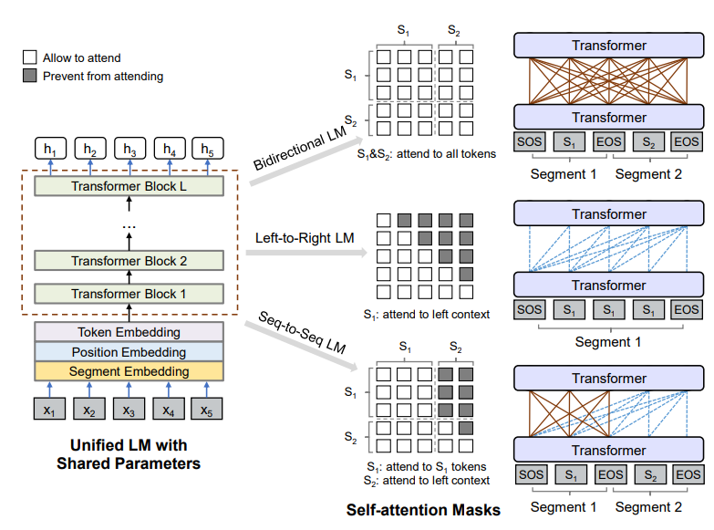
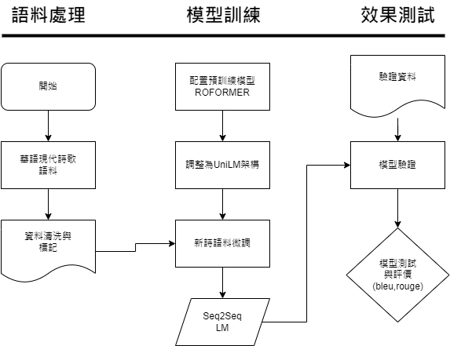

# 詩詞生成方法探討
<!-- 問小敏 -->

## 摘要
  新詩，你可以在捷運的廣告燈箱上看見，也可以在音樂中聽見，是一種廣泛應用在生活之中卻鮮少被發現的文體。且押韻自由，無固定格律，以詩人的個性與感受砌成，有著許多大膽有趣的手法。在現代新詩中用更廣義的定義,將藏頭拓展成藏在任意位子,不管是斜線或圖形都是這篇裡「藏頭」所指的範圍。
  在本研究提出一套流程以詞或字做為起頭，續寫為一篇新詩，並且可以指定每一篇詩的韻腳、長度和指定位置使用什麼字以提供一些特殊的修辭方法，本研究使用[Jianlin Su et al.](https://arxiv.org/abs/2104.09864)中開源的ROFORMER預訓練語言模型並結合[Li Dong et al.](https://arxiv.org/abs/1905.03197)提出的UniLM架構進行微調，並在微調過程中加入生成條件，訓練模型依條件改變生成結果，如生成藏頭詩。除了在詩中藏入訊息以外,使用者也可以指定韻腳以及句子長度,達到細微程度去控制模型生成句子的研究。

關鍵字：新詩生成、

## 1.研究動機與目的

新詩，你可以在捷運的廣告燈箱上看見，也可以在音樂中聽見，是一種廣泛應用在生活之中卻鮮少被發現的文體。且押韻自由，無固定格律，以詩人的個性與感受砌成，有著許多大膽有趣的手法，如藏頭詩。
有鑑於深度學習的崛起，許多研究顯示深度學習在詩詞生成方面皆有不錯的效果，且是生成新詩的重點。

本研究最主要的目標是運用深度學習技術訓練出一個新詩生成模型，並且可以指定每一篇詩的韻腳、長度和指定位置使用什麼字以提供一些特殊的修辭方法。

## 2.相關研究與文獻探討

### 2.1 ROFORMER

ROFORMER 為Jianlin Su et al.提出的預訓練語言模型，其相較於bert有以下不同之處：

#### 2.1.1 字詞混和

使用字為單位，會使序列變長不確定性變高，導致Exposure Bias更高，而使用詞為單位，參數更高，更容易過擬和，且中文的詞是無限的，會更容易出現OOV(Out Of Vocab)的問題。而ROFORMER混合以上兩者，其使用傳統中文字表並加入一定數量(TopN)的中文常用詞，一定程度的緩解字單位模型的長序列問題和Exposure Bias問題，並且透過TopN詞使其相較純詞單位模型的vocab縮小許多，而OOV詞可轉以字單位表示，該方法解決了兩者的缺點，並最大程度保留兩者的優點。

#### 2.1.2 RoPE 旋轉位置編碼

位置編碼的形式也一定程度的影響了預訓練語言模型的在不同長度語料的泛化能力，

首先為了給qk添加絕對位置訊息 假設 q,k ->科學思路 公式1
使用內積->科學思路 公式2

使用 複數指數函數 方式求解
首先 先看複數指數 的定義 -><https://zh.wikipedia.org/zh-tw/%E6%AC%A7%E6%8B%89%E5%85%AC%E5%BC%8F>
的 驗證方法 之 泰勒展開 證明複數指數的基本定義
更改複數指數定義為e^i(theta)f(q,m),e^i(theta)f(k,n),e^i(theta)g(q,k,m-n)

使用 科學空間->求解過程 公式4-8
其中4式 R為 單範正交矩陣(orthonormal matrix),m-n為相對位置
將第四式 第一個 eq(4.1)*eq(4.2) 得到5.1
將第四式 第一個 eq(4.1)/eq(4.2) 取ln 得到5.2
第8式 另 phi(m)=m(theta),phi(m-1)=m(theta)-theta 相減得 (m-m+1)theta=theta
得到結論phi(m)=m(theta)

使用 attention的概念 softmax(QK)*v
首先計算 QK產生

### 2.2 UniLM

UniLM() 為 microsoft 提出的方法，其運用遮罩使bert可以在保持原有雙向語言模型功能下額外提供如GPT的單向語言模型功能和seq2seq架構功能，下圖為UniLM模型架構圖。

Bidirectional LM (上)：
和bert相同，再無須padding的情況下，不使用任何遮罩(-1e9)使特定token的softmax注意力權重歸零，使每個token皆能關注整個序列其他token的資訊。

Left-to-Right LM (中)：
和GPT相同，再無須padding的情況下，使用遮罩(-1e9)使token右方所有token的softmax注意力權重歸零，使模型能關注序列左方token的資訊依序去生成下一個token。

Seq-to-Seq LM (下)：
將序列分為兩部分S1(input)和S2(output)，S1和Bidirectional LM相同，S1每個token皆能關注S1序列其他token的資訊。S2則和Left-to-Right LM相同，S2每個token皆只關注左方(含S1)token的資訊，並依其生成下一個token。

### 2.3 platten & control signal

## 3.新詩生成模型訓練

下圖展示了本研究從語料處裡到模型測試的流程。

圖n：模型訓練實驗流程

本次實驗可以分為三個主要部分：語料處理、模型訓練、效果測試，依清洗和標註後的 <<華語現代詩歌>> 語料，以 99.8:0.1:0.1 的比例切分為訓練集、驗證集和測試集。

### 3.1 語料來源與處理

本次實驗的所使用的資料集為<<華語現代詩歌與料庫>>，截至2022-07-08日該資料庫共蒐集了3425位詩人，79700首詩共15013758字。每首詩皆以下結構表示。

> title:[标题]
>
> date:[写作日期, YYYYMMDD/YYYYMM/YYYY/空]
>
> [正文]

而對每筆詩詞資料會將其以'\n'分割為行，並對其進行標註，

每筆訓練資料形式如下所示：

|IN/TRA|資料形式|
|---   |---     |
|INPUT |[BOS] Ri-3 [SEP] Ri-2 [SEP] Ri-1 [SLICE] 01你（隨機選Ri的字或詞） [SLICE] 02好（隨機選Ri的字或詞） [SLICE] ㄚ(取Ri韻腳) [SLICE] 03(len(Ri)) [EOS]|
|TRAGET|[BOS] Ri [EOS]|

表N：訓練資料格式表。n=random(1~5)，此範例設n=3，Ri=你好嗎

### 3.2 模型構建

#### 3.2.1 BERT (Bidirectional Encoder Representations from Transformers)

於2018年10月，Google AI Language團隊提出了全新的預訓練語意表示(language representation)模型：BERT，其在當時成為了11項自然語言處理任務的SOTA(State Of The Art)模型，該模型透過雙向(無向)的Transformers，並使用MLM(Mask Language Modle)和NSP(Next Sentence Predict)兩樣unsupervse learning Task進行訓練，使其擁有取得文本語意嵌入的能力。這兩項任務中，MLM將輸入序列以一定機率隨機遮蓋，並訓練模型透過上下文訊息將遮蓋字詞還原，而NSP則是將兩個句子輸入，並訓練模型判斷這對句子是否連續，從而使模型建構句之間的語意關係。

#### 3.2.2 ROFORMER

### 3.3 模型評測演算法

#### 3.3.5 BLEU(Bilingual Evaluation Understudy)

#### 3.3.6 ROUGE(Recall-Oriented Understudy for Gisting Evaluation)

## 4.系統展示

## 5.結論

以下只是概述尚未完成：

* 提供一訓練方法使模型可以依條件生成句子(目前無人實現:指定位置生成不定長文本，台大那篇只能指定位置生成一字or一詞，和注音韻腳)

* 口吃(震盪)

* 一步錯，步步錯

* 無法生成圖象詩
